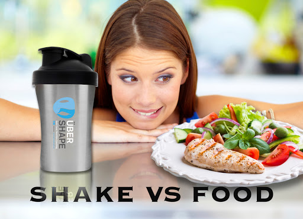

Meal replacements
==========================================

vocabulary
------------------------------------------

=====  ====================   ==========  ==============
序号    词汇                    词性         解释
=====  ====================   ==========  ==============
1      **meal replacement**        \n.          代餐
2      **shed some pounds**        phr.        减肥
3      **satiated**                adj.        饱足的
4      **protein**                 \n.          蛋白质
5      **fiber**                   \n.          纤维
6      **vitamins**                \n.          维生素
7      **minerals**                \n.          矿物质
8      **nutrients**               \n.          营养物质
9      **unprocessed**             adj.        未被加工的
10     **dropped**                 \v.          下降，降低
=====  ====================   ==========  ==============

dialog
------------------------------------------

|:a:| Hey Kevin, what's that you're drinking there?

::

   嗨，Kevin，你在喝什么呢？

|:b:| Oh this? It's my tasty **meal replacement** shake. Chocolate peanut butter. It tastes great!

::

   哦，这个吗？这是我的美味代餐奶昔。巧克力花生酱口味的。很好喝！

|:a:| Why are you drinking that? Trying to **shed some pounds** or something?

::

   你为什么要喝那个呢？想减肥什么的吗？

|:b:| Yeah, it's part of this diet I'm on. I drink one of these every day instead of having lunch.

::

   对，这是我控制饮食计划的一部分。我每天中午会喝一杯来代替午饭。

|:a:| I guess that's one way to cut calories. But does it keep you **satiated**?

::

   我想这确实能减少卡路里摄入了。但你能饱吗？

|:b:| Yep, it's packed with **protein** and **fiber**, so it leaves me feeling full.

::

   能，这里面全是蛋白质和纤维素，所以会让我觉得很饱。

|:a:| But aren't you missing out on essential **vitamins** and **minerals** by not eating solid food?

::

   但不吃固体食物的话，难道不会缺一些必要的维生素和矿物质吗？

|:b:| On the contrary, Gary. It's got all the **nutrients** I need.

::

   恰恰相反，Gary。这里面有我所需的所有营养。

|:a:| I think I'd prefer a more traditional diet of **unprocessed** foods, but you do look slimmer.

::

   我觉得我还是更喜欢非加工食品那种传统饮食方式，但你看起来确实瘦了。

|:b:| Thanks, I've already **dropped** two pant sizes!

::

   谢谢，我已经能穿小两个码的裤子了！

|:a:| That's great. But I guess I'll have to invite someone else to brunch this weekend. Oh, well. Bon appetit!

::

   很不错啊，看来这周末我只能邀请别人一起吃早午餐了。那你享受代餐吧！

explanation
------------------------------------------

On the contrary
~~~~~~~~~~~~~~~~~~~~~~~~~~~~~~~~~~~~~~~~~~

.. note::

   This phrase is used to intensify a denial to what has just been implied or stated by suggesting that the opposite is the case.

   这个短语可用来加强对刚刚所暗示或陈述内容的否定，说明实际情况是正好相反的。

   "On the contrary" may serve as an opening phrase to a longer explanation, or it may stand on its own as an objection to a previous statement.

   On the contrary（正相反，恰恰相反）可以用于一段较长解释的开头，这个短语本身也可以表达对之前陈述的反对。

**Example sentences**

- There was no malice in her; on the contrary, she was very kind.

  她没有任何恶意；相反，她非常友善。

- On the contrary, there was absolutely no wrongdoing.

  正相反，绝对没有任何不良行为。

- The risk of default hasn't decreased. On the contrary, it has increased dramatically.

  违约的风险并没有降低。相反，风险大大增加了。

culture
------------------------------------------

3 things you need to know about meal replacement shakes
~~~~~~~~~~~~~~~~~~~~~~~~~~~~~~~~~~~~~~~~~~~~~~~~~~~~~~~~~~~~~~~~~~~~~~~~~~~~~~~~~~~~

**1. Meal replacement shakes aren't what you think they are.**

Meal replacement shakes do contain ample amounts of protein and other nutrients your body needs, and they can help you lose some weight, when used right. That means you drink a nutrient-rich shake in replacement of one or two meals a day to help you cut your calorie intake. But they're not going to magically help you shed 50 pounds, they're not meant to be used to starve yourself and they're not protein shakes.

**2. Successful meal replacement diets require more than drinking shakes.**

You can't drink a shake, wait 10 minutes, step on the scale and expect to see that you've lost a couple pounds. If you really want to lose weight, you have to eat less and exercise more than you currently are. Meal replacement shakes help with the first part. It keeps you full longer so you don't get the munchies before your next meal.

**3. It's an easy, convenient diet to follow.**

Meal replacement shake diet is pretty easy to follow that doesn't require calorie counting at every meal or reading every label of everything you cook with. Just replace one or two of your meals a day with a meal replacement shake, most choose breakfast or lunch, and then eat a healthy mid-afternoon snack and a balanced dinner.

Source: Nature's sunshine, "`5 things you need to know about meal replacement shakes <https://blog.naturessunshine.com/en/5-things-need-know-meal-replacement-shakes/>`_"