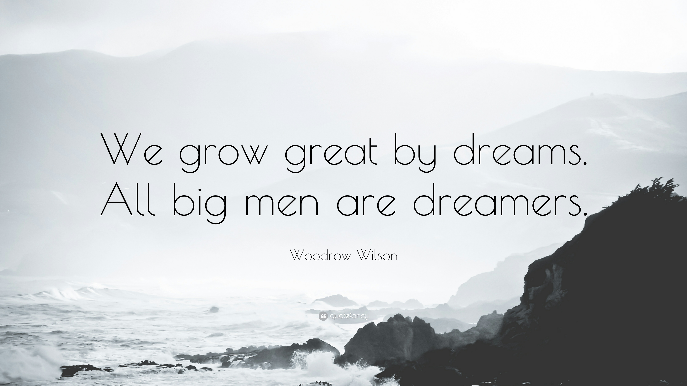

Grow Great by Dreams
==========================================

.. tip:: 因梦想而伟大

The question was once asked of a highly successful businessman, "How have you done so much in your lifetime?"

He replied, "I have dreamed. I have turned my mind loose to imagine what I wanted to do. Then I have gone to bed and thought about my dreams. In the night I dreamt about my dreams. And when I awoke in the morning, I saw the way to make my dreams real. While other people were saying, 'You can't do that, it is impossible,' I was well on my way to achieving what I wanted." As Woodrow Wilson, 28th President of the U.S., said: "We grow great by dreams. All big men are dreamers."

They see things in the soft haze of a spring day, or in the red fire on a long winter's evening. Some of us let these dreams die, but others nourish and protect them; nourish them through bad days until they bring them to the sunshine and light which comes always to those who sincerely hope that their dreams will come true.

So please, don not let anyone steal your dreams, or try to tell you they are too impossible.

"Sing your songs, and dream your dreams, hope your hope and pray your prayer."

----

曾经有人问一个非常成功的商人：“你是怎样在有生之年取得这样的成就呢？”

他回答：“我做梦。我放飞自己的思想，想象自己想要的东西。然后我就上床，沉思自己的梦想。那个晚上，我就可以梦到自己的梦想。当第二天早上醒来，我就看到了通向梦想的路。当别人对我说：‘你做不到，这不可能’，而我总是坚持实现自己梦想的路。”正如美国第28届总统伍德鲁•威尔逊所说：“我们因为梦想而变得伟大。所有伟人都是梦想家。”

他们在春天的薄雾或冬夜的篝火里辨清事物。我们有些人让梦想消失，但有些人却培养、保护它们；在生命低潮时仍然培养它们直到看到太阳和光明，而这些只属于那些真诚希望实现梦想的人们。

所以，请不要让别人偷走你的梦想，或者让他们对你说梦想太遥不可及。

“唱你的歌，做你的梦，给你的希望以希望，给你的祈祷以祈祷。”

